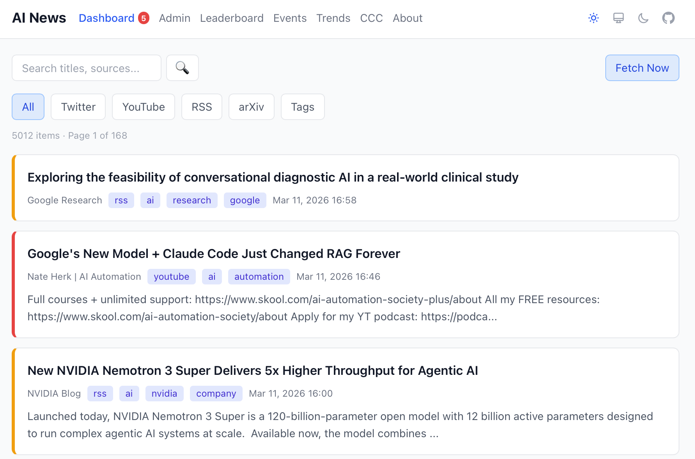
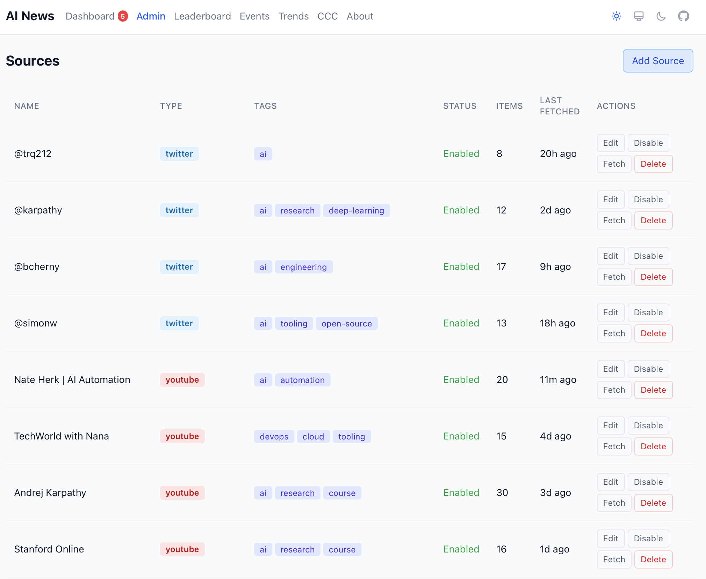

# MyFocalAI

Personal news intelligence system that aggregates AI content from curated sources (RSS, YouTube, Twitter, arXiv, events, GitHub trending, AI tools trending, agent skills), scores relevance using LLM, and serves a web dashboard. Runs locally with Ollama (free) or deployed to Vercel with Claude API scoring.

| Feeds | Admin |
|-------|-------|
|  |  |

## Quick Start

```bash
git clone https://github.com/YanCheng-go/my-focal-ai.git
cd my-focal-ai
./start.sh              # installs deps, starts RSSHub + Ollama, launches dashboard
```

Open http://localhost:8000 — you're done.

```bash
./start.sh --no-score   # skip Ollama (just fetch + display)
./start.sh stop         # stop all services
```

**Prerequisites:** [uv](https://docs.astral.sh/uv/getting-started/installation/) and [Docker](https://docs.docker.com/get-docker/). Optionally [Ollama](https://ollama.ai) for LLM scoring.

## Deployment Modes

| Mode | Stack | Description |
|------|-------|-------------|
| **Local** | SQLite + Ollama + FastAPI | Full-featured, runs on your machine |
| **Online Public** | Vercel + GitHub Actions | Static read-only dashboard, no backend needed |
| **Online Login** | Supabase + Vercel | User accounts, per-user feeds, on-demand fetch |

See [docs/deployment.md](docs/deployment.md) for setup instructions.

## Documentation

- [docs/deployment.md](docs/deployment.md) — deployment modes, setup, configuration
- [docs/development.md](docs/development.md) — dev setup, project structure, commands, conventions
- [docs/architecture.md](docs/architecture.md) — data flow, design decisions
- [docs/module-map.md](docs/module-map.md) — file-by-file module map
- [docs/sources.md](docs/sources.md) — how to configure and add sources
- [docs/scoring.md](docs/scoring.md) — scoring principles, tiers, LLM prompt

## Support

If you find this project useful:

- [Buy Me a Coffee](https://buymeacoffee.com/maverickmiaow)

---

*Last updated: 2026-03-22*
